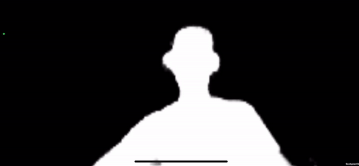

# Meet Segmentation



Meet segmentation from MediaPipe.

## Making Predictions
First, create the predictor:
```csharp
// Fetch the model data from NatML Hub
var accessKey = "<HUB ACCESS KEY>";     // Get your access key at https://hub.natml.ai/profile
var modelData = await MLModelData.FromHub("@natsuite/meet-segmentation", accessKey);
// Deserialize the model
var model = modelData.Deserialize();
// Create the Meet Segmentation predictor
var predictor = new MeetSegmentationPredictor(model);
```

Then segment an image:
```csharp
// Predict
Texture2D input = ...; // This can also be a `WebCamTexture` or any other image feature
MeetSegmentationPredictor.SegmentationMap segmentationMap = predictor.Predict(input);
```

Finally, render the segmentation map to a `RenderTexture`:
```csharp
// Visualize the segmentation map into a `RenderTexture`
var result = new RenderTexture(input.width, input.height, 0);
segmentationMap.Render(result);
```

## Requirements
- Unity 2019.2+
- [NatML 1.0.4+](https://github.com/natsuite/NatML)

## Quick Tips
- See the [NatML documentation](https://docs.natml.ai).
- Join the [NatSuite community on Discord](https://discord.gg/y5vwgXkz2f).
- Discuss [NatML on Unity Forums](https://forum.unity.com/threads/natml-machine-learning-runtime.1109339/).
- Contact us at [hi@natsuite.io](mailto:hi@natsuite.io).

Thank you very much!